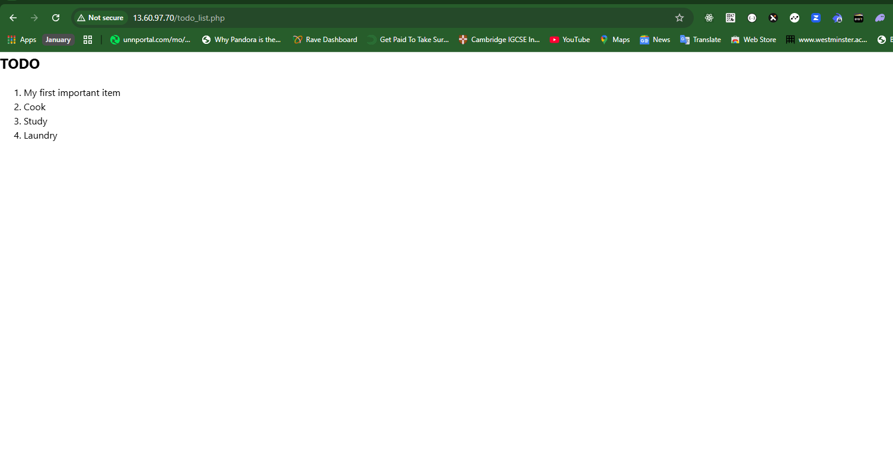

# WEB STACK IMPLEMENTATION (LEMP STACK)

## Step1: Installing nginx web server

```bash
sudo apt update
sudo apt install nginx
```


#### How to access our server through port 80

```bash
curl http://localhost:80
#OR
curl http://127.0.0.1:80
```

#### How to check for your public ip address

```bash
TOKEN=`curl -X PUT "http://169.254.169.254/latest/api/token" -H "X-aws-ec2-metadata-token-ttl-seconds: 21600"` && curl -H "X-aws-ec2-metadata-token: $TOKEN" -s http://169.254.169.254/latest/meta-data/public-ipv4

#OR
curl ifconfig.me
```


## Step 2: Installing MySQL

- Install mysql-server

```bash
sudo apt install mysql-server
```

_MySQL Installation_


- Start the mysql using:

```bash
sudo mysql
```

### Installing MySQL Secure Installation

- Set password for root user at the mysql already running:

```bash
ALTER USER 'root'@'localhost' IDENTIFIED WITH mysql_native_password BY 'password1';
```

- Exit mysql
- Install mysql_secure_installation package and yes to all questions

```bash
sudo apt install mysql_secure_installation
```


Now mysql is pretty much secured and prevents test user and test database for external or remote access.

### MySQL Running on the Terminal


## Step 3 – Installing PHP

```bash
sudo apt install php-fpm php-mysql
```


## Step 4 — Configuring Nginx to Use PHP Processor

When using the Nginx web server, we can create server blocks (similar to virtual hosts in Apache) to encapsulate configuration details and host more than one domain on a single server. In this guide, we will use projectLEMP as an example domain name.

- Create the root web directory for your_domain as follows:

```bash
sudo mkdir /var/www/igweLEMP
```

- Next, assign ownership of the directory with the $USER environment variable, which will reference your current system user:

```bash
sudo chown -R $USER:$USER /var/www/igweLEMP
```

- Then, open a new configuration file in Nginx’s sites-available directory using your preferred command-line editor. Here, we’ll use vim:

```bash
sudo vim /etc/nginx/sites-available/igweLEMP
```

- Paste in the following bare-bones configuration:

```bash
#/etc/nginx/sites-available/projectLEMP

server {
    listen 80;
    server_name igweLEMP www.igweLEMP;
    root /var/www/igweLEMP;

    index index.html index.htm index.php;

    location / {
        try_files $uri $uri/ =404;
    }

    location ~ \.php$ {
        include snippets/fastcgi-php.conf;
        fastcgi_pass unix:/var/run/php/php8.3-fpm.sock;
     }

    location ~ /\.ht {
        deny all;
    }

}
```

- Activate your configuration by linking to the config file from Nginx’s sites-enabled directory:

```bash
sudo ln -s /etc/nginx/sites-available/projectLEMP /etc/nginx/sites-enabled/
```

This will tell Nginx to use the configuration next time it is reloaded. You can test your configuration for syntax errors by typing:

```bash
sudo nginx -t
```

_Here is the result of the configuration test_


-We also need to disable default Nginx host that is currently configured to listen on port 80, for this run:

```bash
sudo unlink /etc/nginx/sites-enabled/default
```

- Reload Nginx to apply the changes:

```bash
sudo systemctl reload nginx
```

- To get our public ip address type:

```bash
curl ifconfig.me
```

- Now go to your browser and try to open your website URL using IP address:

```bash
http://13.48.203.235:80
```

- Our website is now active, but the web root /var/www/igweLEMP is still empty. Create an index.html file in that location so that we can test that our new server block works as expected:


## Step 5 – Testing PHP with Nginx

Open a new file called info.php within your document root in your text editor:

```bash
sudo vim /var/www/igweLEMP/info.php
```

Paste this code:

```bash
<?php
    phpinfo();
?>
```

You can now access this page in your web browser by visiting the domain name or public IP address you’ve set up in your Nginx configuration file, followed by /info.php

```bash
http://13.60.97.70/info.php
```

You can now access this page in your web browser by visiting the domain name or public IP address you’ve set up in your Nginx configuration file, followed by /info.php

```bash
sudo rm /var/www/igweLEMP/info.php
```

_Result of the php file_


## Step 6 — Retrieving data from MySQL database with PHP

- sign in to mysql using:

```bash
sudo mysql -p
```

- Create a database:

```bash
mysql> CREATE DATABASE igwe_db;
```

Now you can create a new user and grant him full privileges on the database you have just created:

```bash
mysql> CREATE USER 'igwe_user'@'%' IDENTIFIED WITH mysql_native_password BY 'password';
```

-Give this user permission over the example_database database:

```bash
mysql> GRANT ALL ON igwe_db.* TO 'igwe_user'@'%';
``
```

- Exit the database:

```bash
mysql> exit
```

- You can test if the new user has the proper permissions by logging in to the MySQL console again, this time using the custom user credentials:

```bash
sudo mysql -u igwe_user -p
```

```bash
mysql> SHOW DATABASES;
```

_Database result_


- Next, we’ll create a test table named todo_list. From the MySQL console, run the following statement:

```bash
mysql> CREATE TABLE igwe_db.todo_list(
mysql>     item_id INT AUTO_INCREMENT,
mysql>     content VARCHAR(255),
mysql>     PRIMARY KEY(item_id)
mysql> );
```

- Insert a few rows of content in the test table.

```bash
mysql> INSERT INTO example_database.todo_list (content) VALUES ("My first important item");
```

- To confirm that the data was successfully saved to your table, run:

```bash
mysql>  SELECT * FROM example_database.todo_list;
```


- Exit from the mysql:

```bash
mysql> exit
```

- Now you can create a PHP script that will connect to MySQL and query for your content. Create a new PHP file in your custom web root directory using your preferred editor. We’ll use vi for that:

```bash
sudo vim /var/www/igweLEMP/todo_list.php
```

- Copy this content into your todo_list.php script:

```bash
<?php
$user = "example_user";
$password = "PassWord.1";
$database = "example_database";
$table = "todo_list";

try {
  $db = new PDO("mysql:host=localhost;dbname=$database", $user, $password);
  echo "<h2>TODO</h2><ol>";
  foreach($db->query("SELECT content FROM $table") as $row) {
    echo "<li>" . $row['content'] . "</li>";
  }
  echo "</ol>";
} catch (PDOException $e) {
    print "Error!: " . $e->getMessage() . "<br/>";
    die();
}
```

_Result of the code in web browser_


